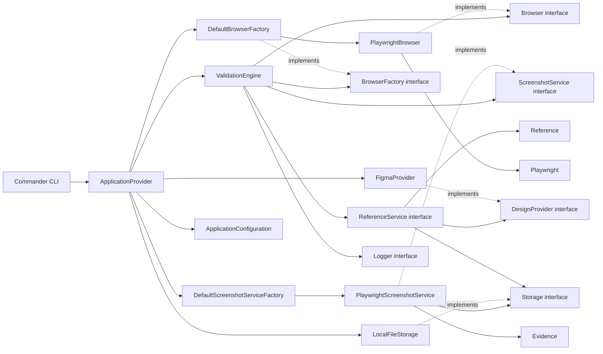

# Atlas Visual

Atlas Visual is an open-source visual validation platform for QA teams. Sprint 4 prepares both inputs for a future comparison engine: captured browser evidence and expected visual references retrieved from a design provider. It does not compare images.

## Objectives

- Provide a dependable CLI entry point for QA workflows.
- Establish a clean architecture that can evolve without coupling core orchestration to external tools.
- Keep infrastructure and future capabilities behind explicit boundaries.

## Architecture principles

Atlas Visual applies Clean Architecture, SOLID, Separation of Concerns, constructor-based dependency injection, and composition over inheritance. Application code depends on abstractions such as `Logger`; concrete infrastructure is composed at the application boundary.

## Sprint 4 reference architecture



`ValidationEngine` imports neither Playwright nor Figma code. It receives `Evidence` through `ScreenshotService` and `Reference` through `ReferenceService`; capture, external downloads, and local persistence remain behind infrastructure boundaries.

## Folder structure

```text
src/
├── index.ts                 # Executable composition root
├── cli/                     # Command-line adapter
├── configuration/           # Typed browser, evidence, and design-provider configuration
├── core/
│   ├── exceptions/          # Domain-level exception hierarchy
│   ├── interfaces/          # Stable abstractions
│   └── models/              # Shared application models
├── engine/                  # Application flow orchestration
├── infrastructure/          # Browser, design-provider, screenshot, storage, and logging adapters
├── providers/               # Dependency composition
├── plugins/                 # Reserved for future plugins
├── reports/                 # Reserved for future reporting
├── actions/                 # Reserved for future actions
└── utils/                   # Reserved for focused shared utilities
tests/                       # Automated tests
docs/                        # Project documentation
```

## Getting started

```bash
npm install
npm run build
npx atlas validate
```

For local development, `npm run validate` builds and executes the command.

## Current sprint — Design reference provider

Sprint 4 adds the technology-independent `Reference` domain model, `DesignProvider` and `ReferenceService` boundaries, and a Figma REST adapter. `atlas validate` captures browser evidence, retrieves the configured Figma frame, and stores both under `artifacts/evidence/` and `artifacts/references/`.

`Reference` belongs to the domain because it exposes the expected image's identity, source, dimensions, timestamp, metadata, and local location without exposing Figma objects. `DesignProvider` allows Figma, Adobe XD, Sketch, local PNG, S3, Azure Blob, or Google Drive adapters to be added without changing `ValidationEngine`.

### Figma configuration

Figma credentials are read only from environment variables; they are never hardcoded or logged.

```bash
export FIGMA_TOKEN="your-figma-token"
export FIGMA_FILE_KEY="your-figma-file-key"
export FIGMA_NODE_ID="your-figma-node-id"
npm run validate
```

## Roadmap

1. Foundation: CLI and execution architecture.
2. Browser abstraction: browser lifecycle and provider boundary.
3. Evidence capture: screenshot capture and artifact storage.
4. Design reference provider (current): expected reference retrieval and storage.
5. Configuration loading and validation, followed by visual comparison and baselines.
5. Reporting, plugins, and workflow actions.

## Future sprints

Future work may introduce configuration loading, comparison algorithms, reports, events, actions, and plugins. Each capability will be introduced through focused interfaces and adapters without making `ValidationEngine` dependent on a vendor or implementation.
