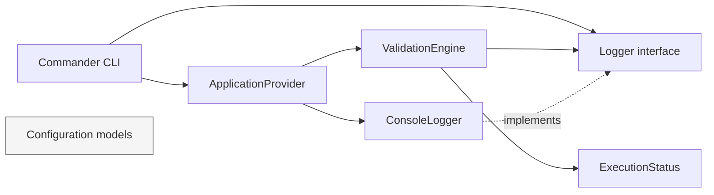

# Atlas Visual

Atlas Visual is an open-source visual validation platform for QA teams. This first sprint establishes the application foundation; it does not yet perform browser automation, capture images, compare pixels, or generate reports.

## Objectives

- Provide a dependable CLI entry point for QA workflows.
- Establish a clean architecture that can evolve without coupling core orchestration to external tools.
- Keep infrastructure and future capabilities behind explicit boundaries.

## Architecture principles

Atlas Visual applies Clean Architecture, SOLID, Separation of Concerns, constructor-based dependency injection, and composition over inheritance. Application code depends on abstractions such as `Logger`; concrete infrastructure is composed at the application boundary.

## Sprint 1 architecture



## Folder structure

```text
src/
├── index.ts                 # Executable composition root
├── cli/                     # Command-line adapter
├── configuration/           # Future configuration models
├── core/
│   ├── exceptions/          # Domain-level exception hierarchy
│   ├── interfaces/          # Stable abstractions
│   └── models/              # Shared application models
├── engine/                  # Application flow orchestration
├── infrastructure/logging/  # Infrastructure adapters
├── providers/               # Dependency composition
├── plugins/                 # Reserved for future plugins
├── reports/                 # Reserved for future reporting
├── actions/                 # Reserved for future actions
└── utils/                   # Reserved for focused shared utilities
tests/                       # Automated tests
docs/                        # Project documentation
```

## Getting started

```bash
npm install
npm run build
npx atlas validate
```

For local development, `npm run validate` builds and executes the command.

## Current sprint — Foundation

Sprint 1 provides the project structure, Commander.js CLI, configuration models, logger abstraction, exception hierarchy, validation engine, and constructor-based composition. `atlas validate` prints the startup banner and executes the engine.

## Roadmap

1. Foundation (current): CLI and execution architecture.
2. Configuration loading and validation.
3. Browser integration and capture workflow.
4. Visual comparison and baselines.
5. Reporting, plugins, and workflow actions.

## Future sprints

Future work may introduce browser automation, design-tool integration, screenshots, comparison algorithms, reports, events, actions, and plugins. Each capability will be introduced through focused interfaces and adapters without making `ValidationEngine` dependent on a vendor or implementation.
