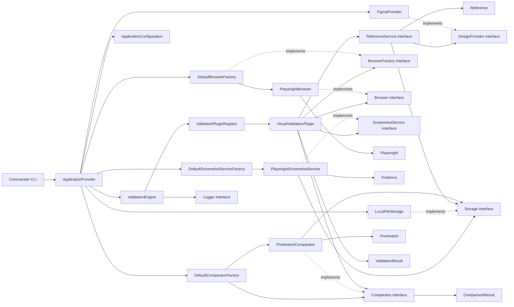

# Atlas Visual

Atlas Visual is an open-source visual validation platform for QA teams. Sprint 6 composes browser evidence, design references, and comparison through an independently registered visual-validation plugin.

## Objectives

- Provide a dependable CLI entry point for QA workflows.
- Establish a clean architecture that can evolve without coupling core orchestration to external tools.
- Keep infrastructure and future capabilities behind explicit boundaries.

## Architecture principles

Atlas Visual applies Clean Architecture, SOLID, Separation of Concerns, constructor-based dependency injection, and composition over inheritance. Application code depends on abstractions such as `Logger`; concrete infrastructure is composed at the application boundary.

## Sprint 6 plugin architecture



`ValidationEngine` imports neither Playwright, Figma, Pixelmatch, screenshot, nor design-provider code. It resolves registered `ValidationPlugin` implementations and aggregates generic results. `VisualValidationPlugin` owns visual orchestration through stable interfaces.

## Folder structure

```text
src/
├── index.ts                 # Executable composition root
├── cli/                     # Command-line adapter
├── configuration/           # Typed browser, evidence, design, and comparison configuration
├── core/
│   ├── exceptions/          # Domain-level exception hierarchy
│   ├── interfaces/          # Stable abstractions
│   └── models/              # Shared application models
├── engine/                  # Application flow orchestration
├── infrastructure/          # Browser, design, screenshot, storage, logging, and comparator adapters
├── providers/               # Dependency composition
├── plugins/                 # Reserved for future plugins
├── reports/                 # Reserved for future reporting
├── actions/                 # Reserved for future actions
└── utils/                   # Reserved for focused shared utilities
tests/                       # Automated tests
docs/                        # Project documentation
```

## Getting started

```bash
npm install
npm run build
npx atlas validate
```

For local development, `npm run validate` builds and executes the command.

## Current sprint — Visual validation plugin

Sprint 6 adds `VisualValidationPlugin`, plugin registration, multiple-page execution, failure aggregation, and CLI exit codes. Each page captures evidence, retrieves a reference, compares it, and produces a `ValidationResult`.

Add pages under `visual.pages`; each page is evaluated independently. The CLI exits with `0` when every page passes, `1` for comparison failures, `2` for configuration errors, and `3` for execution errors.

`Comparator` is an abstraction so Pixelmatch can later be replaced by Percy, Applitools, Resemble.js, OpenCV, or an AI-based engine without changing `ValidationEngine`. `ComparisonResult` is technology-independent: it reports status, metrics, duration, and optional diff location without exposing Pixelmatch or PNGJS objects.

### Comparison configuration

`pixelThreshold` controls Pixelmatch's per-pixel sensitivity (from 0 to 1; lower values detect smaller color changes). `allowedDifferencePercentage` is a separate acceptance limit for the final result: the comparison passes only when the percentage of differing pixels is at or below that value.

```text
visual.comparison.comparator = pixelmatch
visual.comparison.pixelThreshold = 0.1
visual.comparison.allowedDifferencePercentage = 1.0
```

The Pixelmatch adapter supports PNG images and rejects unreadable files or incompatible dimensions without resizing them. When differences exist, it writes a diff image through the existing `Storage` abstraction.

To add another comparator, implement `Comparator` in infrastructure and extend `DefaultComparatorFactory` for a new configured provider; no change to `ValidationEngine`, `Evidence`, `Reference`, or `ComparisonResult` is needed.

### Figma configuration

Figma credentials are read only from environment variables; they are never hardcoded or logged.

```bash
export FIGMA_TOKEN="your-figma-token"
export FIGMA_FILE_KEY="your-figma-file-key"
export FIGMA_NODE_ID="your-figma-node-id"
npm run validate
```

## Roadmap

1. Foundation: CLI and execution architecture.
2. Browser abstraction: browser lifecycle and provider boundary.
3. Evidence capture: screenshot capture and artifact storage.
4. Design reference provider: expected reference retrieval and storage.
5. Visual comparator: comparison results and generated diffs.
6. Visual validation plugin (current): page orchestration and aggregate results.
7. Configuration loading, validation, and workflow integrations.

## Future sprints

Future work may introduce configuration loading, reports, events, actions, and plugins. Each capability will be introduced through focused interfaces and adapters without making `ValidationEngine` dependent on a vendor or implementation.
