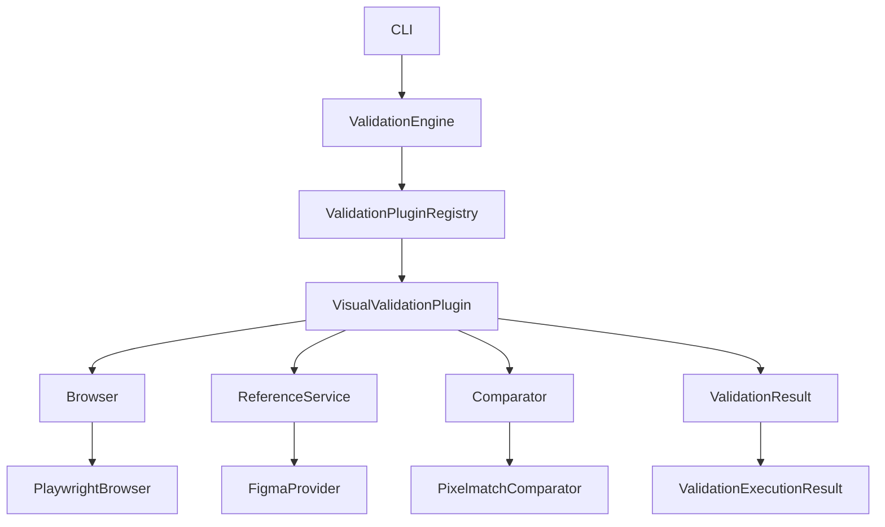

# Atlas Visual architecture

The engine resolves registered plugins only. The visual plugin validates each configured page independently, aggregates results after browser shutdown, and maps configuration failures to CLI exit code `2`, comparison failures to `1`, and execution errors to `3`.
