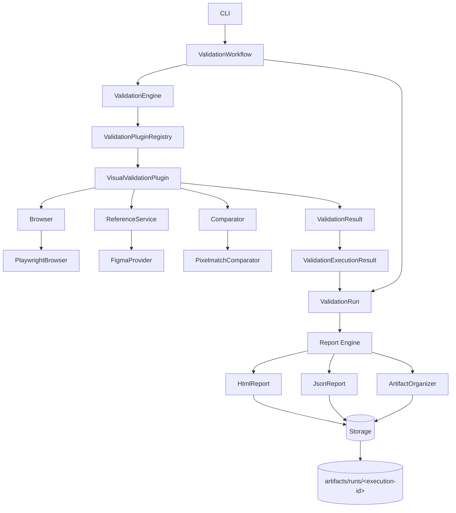
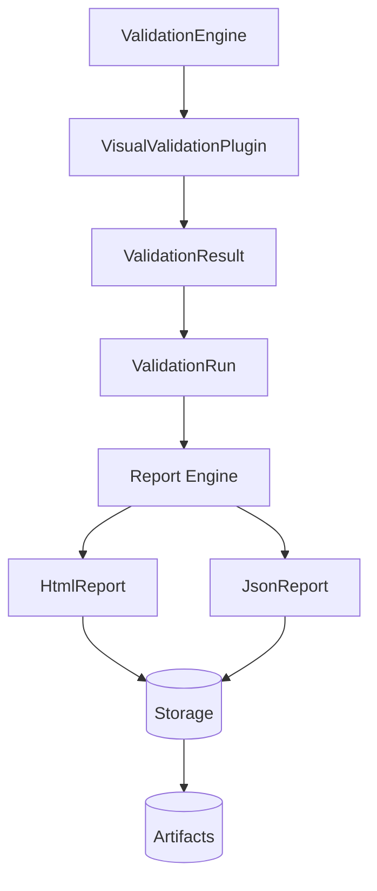
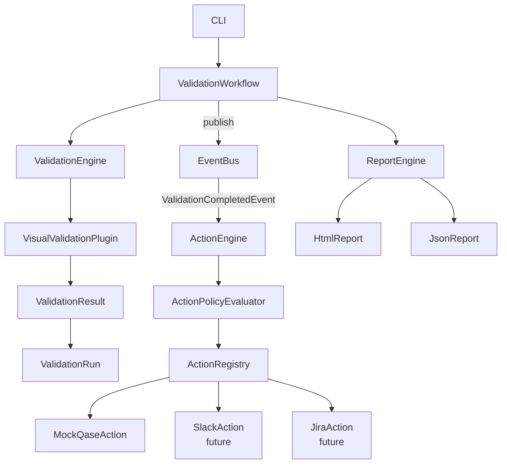
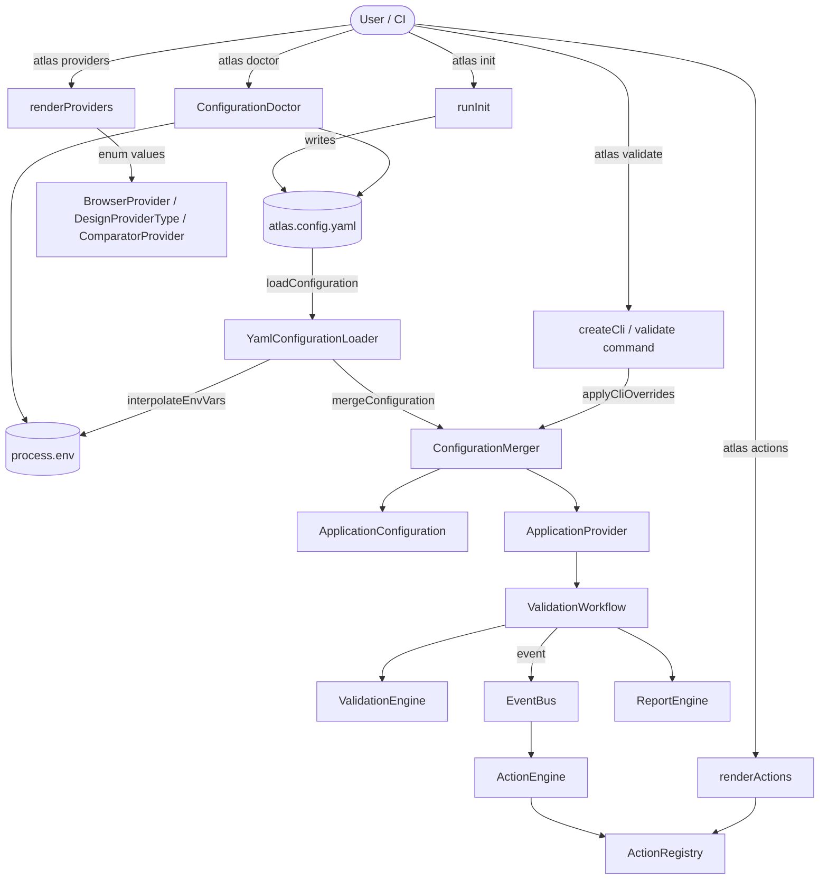
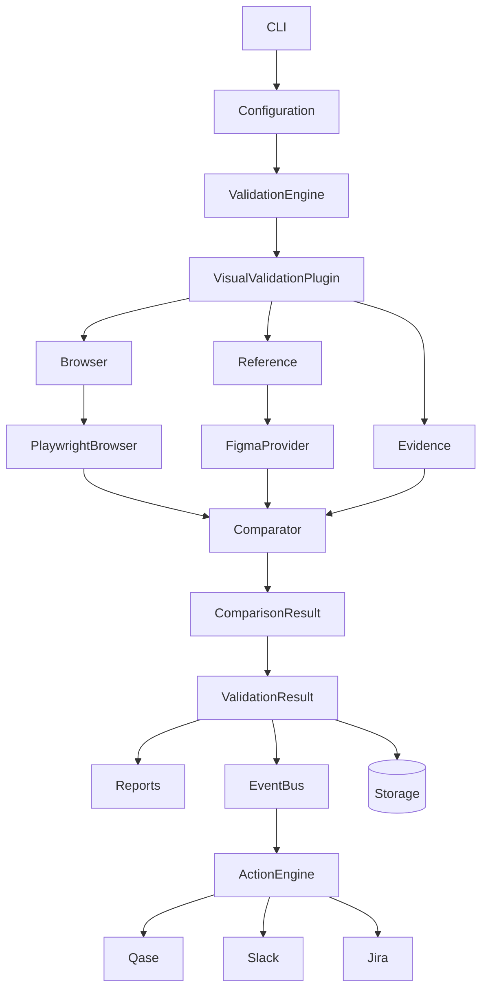

# Atlas Visual architecture



The engine resolves registered plugins only. The visual plugin validates each configured page
independently, aggregates per-plugin results after browser shutdown, and maps configuration
failures to CLI exit code `2`, comparison failures to `1`, and execution errors to `3`.

## Report layer (Sprint 7)



### Dependency direction

```
ValidationResult ─▶ ValidationRun ─▶ Report ─▶ HtmlReport / JsonReport ─▶ Storage
```

The report layer consumes the generic `ValidationRun` aggregate. It never imports Playwright,
Figma, Pixelmatch, `BrowserProvider`, `DesignProvider`, or `VisualValidationPlugin`, and the
`core` layer never imports `node:fs`, an HTML library, or any vendor SDK.

### Components

| Component                                          | Responsibility                                                                                                                                                |
| -------------------------------------------------- | ------------------------------------------------------------------------------------------------------------------------------------------------------------- |
| `ExecutionIdFactory` / `DefaultExecutionIdFactory` | Creates a unique, filesystem-safe execution id such as `2026-08-31T21-30-42Z-a8f31`.                                                                          |
| `ValidationWorkflow`                               | Application orchestration: creates the execution id, runs the engine, builds the `ValidationRun`, invokes the report engine.                                  |
| `buildValidationRun`                               | Builds the canonical run-level aggregate by summing the Sprint 6 per-plugin `ValidationExecutionResult` totals — counts are never recomputed per page.        |
| `Report` (interface)                               | `generate(run, context) => ReportResult`. Implemented by `HtmlReport` and `JsonReport`.                                                                       |
| `ReportRegistry` / `DefaultReportRegistry`         | Selects the reports enabled by configuration.                                                                                                                 |
| `ArtifactOrganizer`                                | Copies each page's evidence, reference, and diff image into the isolated run directory through the `Storage` abstraction and returns portable relative paths. |
| `ReportEngine`                                     | Organizes artifacts, then asks every enabled report to render itself. Wraps failures in `ReportGenerationException` (never silent).                           |

### Artifact structure

Each execution is isolated under a run directory; previous executions are never overwritten.

```text
artifacts/
  runs/
    2026-08-31T21-30-42Z-a8f31/
      report/
        index.html
        report.json
      evidence/
        homepage.png
        about.png
      references/
        homepage.png
        about.png
      diffs/
        about-diff.png
```

### Execution IDs

`DefaultExecutionIdFactory` returns `<ISO-8601 seconds with ':' replaced by '-'>-<5 char id>`, for
example `2026-08-31T21-30-42Z-a8f31`. The value is safe to use directly as a directory name on
every platform and keeps runs chronologically sortable. The same id is passed to
`ValidationEngine.execute(executionId)` and used to name the run directory.

### Portability

`HtmlReport` references artifacts with relative POSIX paths (`../evidence/homepage.png`). Opening
`report/index.html` from the run directory — locally, from a CI artifact bundle, or from an
archive — resolves every image. Reports contain no absolute machine paths and no source-repository
paths.

### Configuration

```text
report.enabled           = true          # master switch for the report layer
report.outputDirectory   = artifacts     # root that contains runs/<execution-id>
report.html.enabled      = true
report.json.enabled      = true
```

Setting `report.html.enabled = false` (or `report.json.enabled = false`) disables that format only.
Setting `report.enabled = false` disables all report generation; the run directory path is still
reported by the CLI.

### Security

Reports never print API tokens, passwords, credentials, authorization headers, or environment
secrets. String metadata is passed through a redactor that masks any value whose key matches
`token`, `secret`, `password`, `authorization`, `auth`, `credential`, `api[_-]?key`,
`access[_-]?key`, `bearer`, `cookie`, or `session`.

### Extending the report layer

Add a new format (JUnit XML, Markdown, PDF, Allure, a custom CI report) by implementing `Report`
and registering it in `DefaultReportRegistry` with a configuration flag. `ValidationEngine`,
`ValidationWorkflow`, and the domain models do not change.

---

## Event Bus & Action Engine (Sprint 8)

### Core principle

Validation produces a result. Other components decide what to do with that result.

```
ValidationResult
      │
      ├──▶ HTML Report
      │
      ├──▶ JSON Report
      │
      └──▶ Actions (via EventBus)
             ├──▶ Qase
             ├──▶ Slack
             └──▶ Jira
```

The validation flow contains no Qase, Slack, Jira, or GitHub logic. Actions are decoupled via events.

### Full event-driven flow



### EventBus

`EventBus` is a pure interface in `core/interfaces/`. `InMemoryEventBus` is the in-process
implementation — no global singleton, always injected.

```typescript
interface EventBus {
  publish<T extends Event>(event: T): Promise<void>;
  subscribe<T extends Event>(eventType: string, handler: EventHandler<T>): void;
  unsubscribe<T extends Event>(eventType: string, handler: EventHandler<T>): void;
}
```

Handlers registered for a type run concurrently (`Promise.allSettled`). A failing handler does not
prevent other handlers from executing.

### Lifecycle events

| Event                                               | When                                    |
| --------------------------------------------------- | --------------------------------------- |
| `ValidationStartedEvent` (`validation.started`)     | Execution begins                        |
| `ValidationCompletedEvent` (`validation.completed`) | Run assembled successfully              |
| `ValidationFailedEvent` (`validation.failed`)       | Unrecoverable error prevents completion |

`ValidationCompletedEvent` carries the full `ValidationRun`. It is published by
`ValidationWorkflow` after `buildValidationRun` completes — the workflow is the natural publisher
because it owns the run assembly. `ValidationEngine` remains unaware of events or actions.

### Action abstraction

```typescript
interface Action {
  readonly id: string; // e.g. "qase"
  readonly name: string; // e.g. "Qase"
  execute(context: ActionContext): Promise<ActionResult>;
}
```

`ActionContext` provides only generic information: executionId, environment, `ValidationRun`, and
`Logger`. No Playwright, Figma, or Pixelmatch objects are exposed.

`ActionResult` carries: `actionId`, `actionName`, `success`, `status` (executed / skipped / failed),
`duration`, `message`, and `metadata`.

### ActionRegistry

`DefaultActionRegistry` is a Map-backed registry. Registering a new action requires no changes to
`ActionEngine`, `ActionPolicyEvaluator`, or any other component.

```typescript
interface ActionRegistry {
  register(action: Action): void;
  resolve(actionId: string): Action;
  all(): Action[];
}
```

### ActionPolicy

Each action is controlled by a policy in configuration:

```yaml
actions:
  qase:
    enabled: true
    onlyOnFailure: true
    environments:
      - staging
      - production
  slack:
    enabled: false
```

```typescript
interface ActionPolicy {
  enabled: boolean;
  environments?: string[]; // empty or omitted = no restriction
  onlyOnFailure?: boolean;
}
```

### ActionPolicyEvaluator

`DefaultActionPolicyEvaluator` applies policy rules in order:

1. `enabled` must be `true`.
2. If `environments` is non-empty, the current `environment` string must appear in it.
3. If `onlyOnFailure` is `true`, `run.status` must be `Failed`.

The evaluator contains all policy logic. `ActionEngine` delegates to it without embedding business rules.

### ActionEngine

`ActionEngine` implements `EventHandler<ValidationCompletedEvent>`. It:

1. Receives the event and delegates to `execute(run)`.
2. Iterates registered actions via `ActionRegistry`.
3. Evaluates each action's policy via `ActionPolicyEvaluator`.
4. Executes eligible actions concurrently with `Promise.allSettled`.
5. Collects `ActionResult[]` and logs a summary.

**Execution strategy:** `Promise.allSettled` — actions run concurrently and one failure never
prevents others from completing. The `ValidationRun` is never mutated.

**Action failure isolation:** A throwing action produces an `ActionResult` with `success: false`
and `status: failed`. Other actions continue executing. The `ValidationRun.status` remains
unchanged.

### MockQaseAction

`MockQaseAction` (`src/actions/mock-qase.action.ts`) demonstrates the Action contract without
making real API calls. Given failed pages it logs the defect titles it _would_ create:

```
[BUG][Visual Automation] homepage visual difference
[BUG][Visual Automation] about visual difference
```

Future implementation replaces the body with `QaseClient.createDefect(title, description, attachments)`.
The ValidationEngine, VisualValidationPlugin, ReportEngine, and Comparator require no changes.

### Execution summary log

```
Actions:
  ✔ Qase
  - Slack: Skipped (disabled in configuration)
Action Engine: 1 executed (1 succeeded, 0 failed), 1 skipped.
```

### Configuration

```text
environment                = staging     # named environment for policy matching
actions.qase.enabled       = true
actions.qase.onlyOnFailure = true
actions.qase.environments  = [staging, production]
actions.slack.enabled      = false
```

Both fields are optional. When `actions` is omitted, all actions default to `enabled: false`.
When `environment` is omitted, environment restrictions are evaluated against an empty string.

### Dependency rules

| Layer              | Must NOT import                             |
| ------------------ | ------------------------------------------- |
| `ValidationEngine` | Qase, Slack, Jira, GitHub SDKs              |
| `ActionEngine`     | Qase SDK, Slack SDK, Jira SDK               |
| `core/`            | Any vendor SDK or `node:fs`                 |
| `reports/`         | Action, EventBus, or any vendor integration |

Each Action owns its external integration. `ActionEngine` knows only the `Action` interface.

### SOLID analysis

| Principle                     | How it applies                                                                                                                                                                  |
| ----------------------------- | ------------------------------------------------------------------------------------------------------------------------------------------------------------------------------- |
| **S** — Single Responsibility | `ValidationEngine` validates. `ActionEngine` executes actions. `ActionPolicyEvaluator` enforces policies. `ActionRegistry` stores actions. Each class has one reason to change. |
| **O** — Open/Closed           | Adding Jira or Slack requires implementing `Action` and calling `register()`. No existing class changes.                                                                        |
| **L** — Liskov Substitution   | Any `Action` implementation is substitutable. `MockQaseAction` is replaced by the real `QaseAction` without changing the engine.                                                |
| **I** — Interface Segregation | `EventBus`, `EventHandler`, `Action`, `ActionRegistry`, and `ActionPolicyEvaluator` are narrow single-purpose interfaces.                                                       |
| **D** — Dependency Inversion  | `ActionEngine` depends on `ActionRegistry` and `ActionPolicyEvaluator` abstractions, not concrete classes. `ValidationWorkflow` depends on `EventBus`, not `InMemoryEventBus`.  |

### Future Qase architecture

```
QaseAction
    │
    └──▶ QaseClient interface
              │
              └──▶ Real Qase API implementation (Sprint N)
```

The `QaseClient` interface allows the HTTP client to be mocked in unit tests. Sprint 8 proves the
wiring; the real network call is confined to a single class in a future sprint.

---

## CLI & Developer Experience (Sprint 9)

### Entry point

```
atlas init       → interactive YAML config generator
atlas doctor     → environment + config diagnostics
atlas validate   → visual validation (with per-run overrides)
atlas providers  → list browser / design / comparator providers
atlas actions    → list registered actions and their policy
atlas version    → display version
```

### Configuration loading

`YamlConfigurationLoader` (`src/configuration/yaml-configuration-loader.ts`) reads
`atlas.config.yaml` (or `atlas.config.yml`) from the current directory, or from a path supplied
via `--config`. The file is parsed with the bundled `yaml` package.

**Environment variable interpolation** happens before YAML parsing: every `${VAR_NAME}` token is
replaced with the value from `process.env`. Missing variables become empty strings — never a crash.

**Configuration precedence (highest → lowest):**

```
CLI flags  →  Environment variables  →  atlas.config.yaml  →  Built-in defaults
```

`ConfigurationMerger` (`src/configuration/configuration-merger.ts`) handles two merge operations:

1. `mergeConfiguration(defaults, yamlDoc)` — merge YAML onto the built-in defaults.
2. `applyCliOverrides(base, cliOverrides)` — apply per-run CLI flags without persisting to disk.

Array fields (e.g. `visual.pages`) are replaced entirely by YAML values; scalar and object fields
are merged field-by-field so omitted YAML keys inherit their defaults.

### atlas init

Interactive flow (requires a TTY; exits with code 2 in CI):

1. Checks if `atlas.config.yaml` already exists — asks before overwriting.
2. Collects: project name, environment, target URL, page ID, Figma node ID, report formats, Qase toggle.
3. Writes `atlas.config.yaml` with `${FIGMA_FILE_KEY}` placeholders — **secrets are never collected**.

### atlas doctor

`ConfigurationDoctor` (`src/cli/commands/doctor.ts`) runs ordered checks:

| Check              | What it verifies                           |
| ------------------ | ------------------------------------------ |
| Node.js            | Version ≥ 18                               |
| Configuration file | atlas.config.yaml was found                |
| Browser provider   | `playwright` is configured                 |
| FIGMA_TOKEN        | Env var is non-empty (value never printed) |
| Figma file key     | At least one page has a fileKey            |
| Comparator         | `pixelmatch` is configured                 |
| Storage            | Output directory is non-empty              |
| Reports            | At least one format enabled                |
| Actions            | One entry per configured action            |

Failed checks include a **Fix:** line with the exact command or configuration change.

### atlas validate — per-run overrides

The `--config`, `--environment`, `--qase/--no-qase`, `--html/--no-html`, `--json/--no-json`,
`--quiet`, and `--verbose` flags are applied by `applyCliOverrides()` at runtime.

The YAML file on disk is **never modified**. A new `ApplicationProvider` is instantiated with the
merged configuration for that execution.

### CLI architecture

The CLI (`src/cli/create-cli.ts`) is a pure presentation layer:

- Parses arguments (Commander.js)
- Delegates to application services (`ConfigurationDoctor`, `renderProviders`, `renderActions`, `runInit`)
- Formats output with `CliOutput` (icons, dividers, structured sections)
- Maps results to exit codes

No validation business logic, browser code, Figma code, or Pixelmatch code lives in the CLI layer.

### SOLID analysis (Sprint 9)

| Question                                                        | Answer                                                                                                                           |
| --------------------------------------------------------------- | -------------------------------------------------------------------------------------------------------------------------------- |
| Why is CLI logic separated from application logic?              | SRP — the CLI translates user intent into service calls. Business rules in the CLI are untestable without a real terminal.       |
| Why is configuration validation separated from execution?       | SRP — `ConfigurationDoctor` reasons about config shape; `VisualValidationPlugin` does validation. Each has one reason to change. |
| Why does `renderProviders` use enum values?                     | OCP — adding a new provider updates the enum; no if-chain in the CLI.                                                            |
| Why does `renderActions` use `ActionRegistry`?                  | DIP — the CLI depends on an abstraction, not a hardcoded list. New actions appear automatically.                                 |
| How can future CLI commands be added without touching the core? | Each command is a module that calls existing services. `createCli.ts` is the only file that grows.                               |

### Full Sprint 9 architecture diagram



## Production readiness (Sprint 10 / v1.0)

Sprint 10 hardened the existing design for a v1.0 open-source release. No product architecture
was rewritten; the work was tests, tooling, security, documentation, and finishing the `clean`
command. This section is the final, canonical architecture reference.

### Final architecture diagram



### Clean Architecture layers

Dependencies point **inward**. Outer layers know about inner layers; inner layers know nothing
about outer layers.

| Layer                | Contents                                                                            | Depends on                      |
| -------------------- | ----------------------------------------------------------------------------------- | ------------------------------- |
| **Domain**           | `core/models`, `core/interfaces`, `core/exceptions`, `core/events`                  | nothing                         |
| **Application**      | `engine/` (ValidationEngine, ValidationWorkflow, ActionEngine), `reports/` builders | Domain                          |
| **Infrastructure**   | `infrastructure/` (Playwright, Figma, Pixelmatch, storage, event bus, logging)      | Domain, Application             |
| **Presentation**     | `cli/` (Commander, `CliOutput`, commands)                                           | Application, Domain             |
| **External systems** | Chromium, Figma API, filesystem, (future) Qase/Slack/Jira APIs                      | reached only via Infrastructure |

Verified rule: no file under `core/` or `engine/` imports Playwright, Figma, Pixelmatch,
`node:fs`, or any vendor SDK. The report layer consumes the generic `ValidationRun` only.

### Architectural rules (enforced by review + the PR checklist)

- Core cannot depend on infrastructure.
- `ValidationEngine` cannot import Playwright, Figma, or Pixelmatch.
- Reports cannot depend on Playwright, Figma, or Pixelmatch.
- Actions cannot depend on HTML parsing or browser internals.
- External providers must implement a core abstraction.
- Secrets must never be part of domain models, reports, or logs.

### SOLID review (v1.0)

- **Single Responsibility** — `VisualValidationPlugin` validates a page; `ArtifactOrganizer`
  moves files; `ConfigurationDoctor` reasons about config; `CliOutput` formats output. Each has
  one reason to change.
- **Open/Closed** — new browsers, design sources, comparators, actions, and reports are added by
  implementing an interface and registering it. The engine and CLI are closed to modification;
  `renderProviders` iterates enum values and `renderActions` iterates the `ActionRegistry`.
- **Liskov Substitution** — any `Browser`, `Comparator`, `DesignProvider`, `Report`, or `Action`
  is substitutable; tests swap real implementations for fakes without changing the engine.
- **Interface Segregation** — interfaces are narrow (`Comparator.compare`, `Report.generate`,
  `Action.execute`, `Storage` read/write). Consumers depend only on what they use.
- **Dependency Inversion** — `engine`/`plugin` depend on `core` abstractions; concrete
  Playwright/Figma/Pixelmatch classes are injected via factories at the composition root
  (`ApplicationProvider`).

### Provider extensibility exercise

Adding a provider must **not** touch the core. Illustrative file-level changes only:

| Add…                       | New file(s) (infrastructure)                   | Register in                      | Core changes |
| -------------------------- | ---------------------------------------------- | -------------------------------- | ------------ |
| **Selenium** browser       | `infrastructure/browser/selenium-browser.ts`   | `DefaultBrowserFactory`          | none         |
| **Adobe XD** design source | `infrastructure/design/adobe-xd-provider.ts`   | `DefaultReferenceServiceFactory` | none         |
| **Percy/SSIM** comparator  | `infrastructure/comparator/ssim-comparator.ts` | `DefaultComparatorFactory`       | none         |

Each implements the existing abstraction (`Browser`, `DesignProvider`/`ReferenceService`,
`Comparator`) and is selected by configuration. See ADRs [001](adr/001-browser-abstraction.md),
[002](adr/002-design-provider-abstraction.md), [003](adr/003-comparator-abstraction.md).

### Action extensibility

Adding **Qase**, **Slack**, **Jira**, or **GitHub Issues** requires a new `Action` implementation
(e.g. `actions/slack.action.ts`) registered with the `ActionRegistry`. It does **not** modify
`ValidationEngine`, `VisualValidationPlugin`, the `Comparator`, or the reports — those emit/consume
domain results and know nothing about integrations. See [ADR-004](adr/004-event-driven-actions.md).

Intended future Qase flow (Qase stays optional and credential-free until wired):

```
ValidationResult → ActionEngine → QaseAction → QaseClient → Qase API
```

### Test strategy

| Level           | Scope                                                                                                                                | Command                    |
| --------------- | ------------------------------------------------------------------------------------------------------------------------------------ | -------------------------- |
| **Unit**        | Domain models, engine, plugin, comparator, reports, event bus, action engine, configuration, CLI services                            | `npm run test:unit`        |
| **Integration** | Real Playwright, screenshot capture, local storage, Figma (mocked HTTP), Pixelmatch, reports, event/action pipeline                  | `npm run test:integration` |
| **End-to-end**  | Full pipeline: CLI → config → engine → plugin → browser → evidence → reference → comparator → result → reports → actions → exit code | `npm run test:e2e`         |
| **Coverage**    | `c8` over the full suite, source-mapped to TypeScript                                                                                | `npm run test:coverage`    |

Tests use local fixtures and never require Figma or Qase credentials. Coverage is prioritized on
critical paths (configuration, orchestration, comparator, aggregation, reports, action policies,
CLI exit codes, error handling) rather than a blanket percentage target. Gaps are recorded in
[technical-debt.md](technical-debt.md).
